# CloudLabs Validations Using AWS Lambda

### Steps to Use CloudLabs Validations Using AWS Lambda

### **Prerequisites**

Before performing validations using AWS Lambda in CloudLabs, please make sure that the AWS Lambda function is set up properly. To set it up, please follow the steps below.

> **Note:** This is just an example where we are using AWS Lambda to validate whether an S3 bucket is present or not. The setup is deployed in a separate account, and during validation, we use the CloudLabs ODL user to validate the S3 bucket in the account where the actual Lambda function and S3 bucket reside.

1. Log in to your AWS account and search for **IAM** in the search bar. Then click on it.

   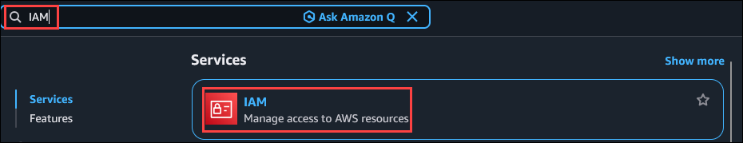

2. Click on **Roles**, and then click **Create role**.

   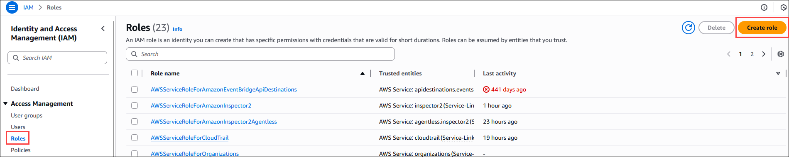

3. Select **AWS service** and choose **Lambda**. Then click **Next**.

   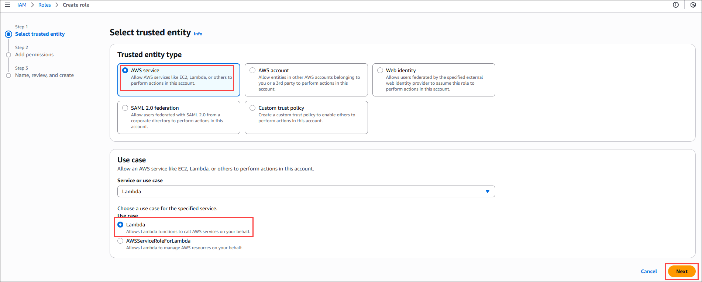

4. Search for the policy named **AmazonS3ReadOnlyAccess** and check the box next to it. Then click **Next**.

   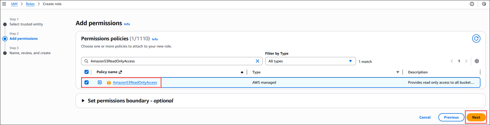

5. Provide the role name as **LambdaS3CheckerRole**, and click **Create role**.

   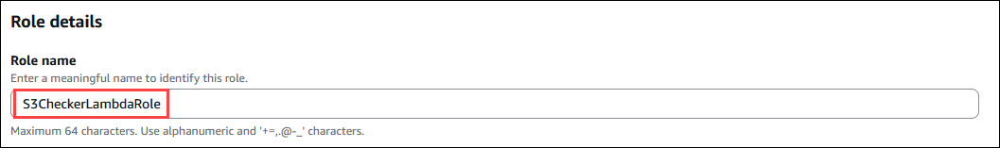

6. Search for **Lambda** in the search bar and click on it.

   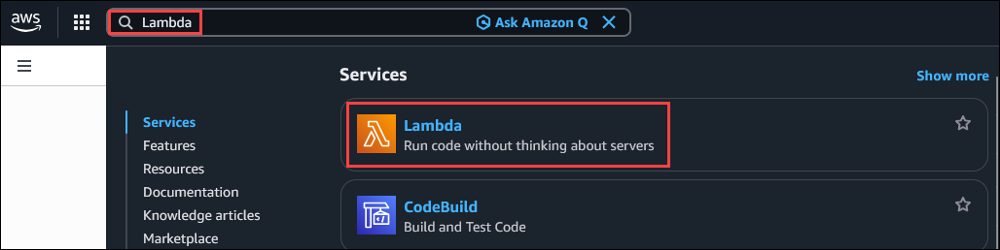

7. Click on **Functions**, and then click on **Create function**.

   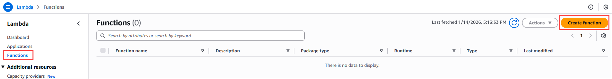

8. Choose **Author from scratch** and provide the following:

   **Function name**: `S3BucketChecker`
   **Runtime**: Select **Python 3.12** (or the latest version).

   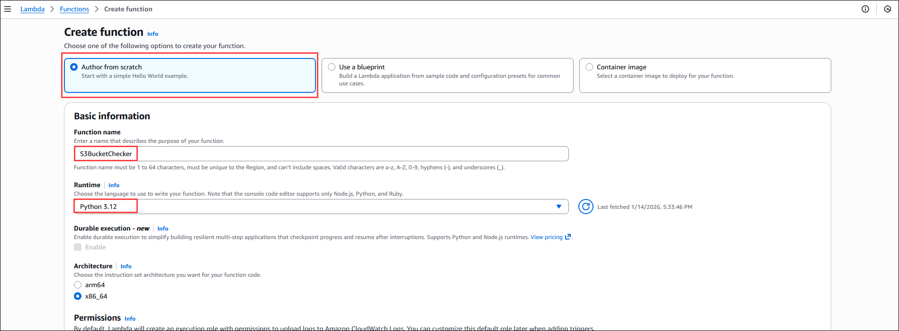

9. Under **Permissions**, click **Change default execution role** and select **Use an existing role**. Choose the **LambdaS3CheckerRole** you created in Step 1. Then click **Create function**.

   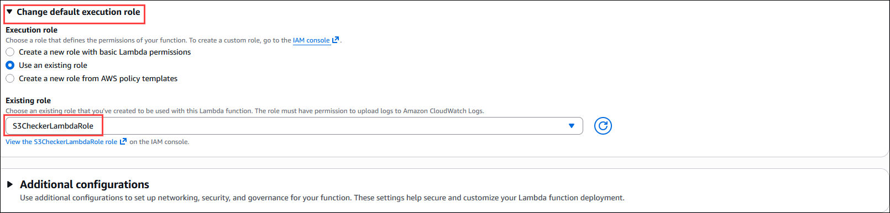

10. In the **Code** tab, delete the existing code and paste the following:

```python
import boto3
from botocore.exceptions import ClientError

def lambda_handler(event, context):
    # REPLACE THIS with the name of the bucket you want to check
    bucket_name = 'your-bucket-name-here'
    
    s3 = boto3.client('s3')
    
    try:
        # This checks if the bucket exists and if you have permission to access it
        s3.head_bucket(Bucket=bucket_name)
        return {
            'statusCode': 200,
            'body': f"Success! S3 bucket '{bucket_name}' exists in the account."
        }
    except ClientError:
        return {
            'statusCode': 404,
            'body': f"S3 bucket '{bucket_name}' does not exist in the account."
        }
```

11. Click **Deploy**.

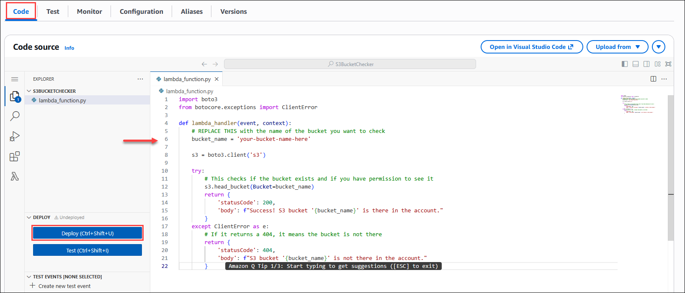

12. Click the **Test** button (blue button).

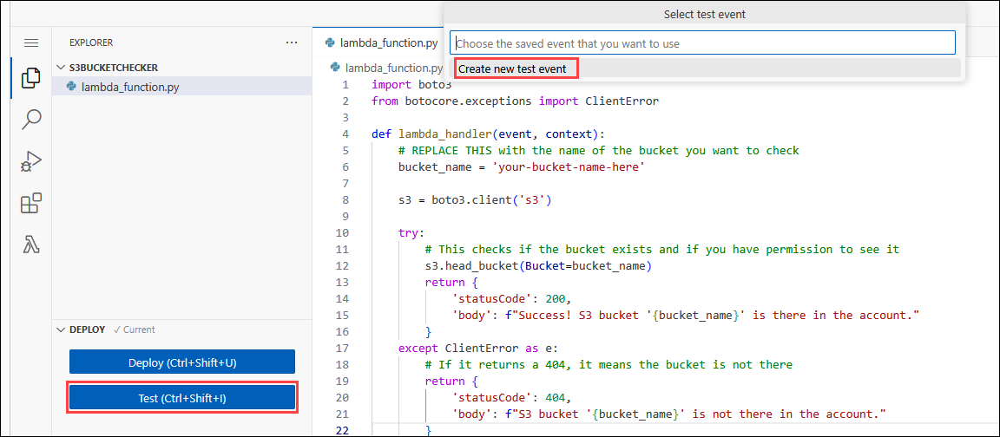

13. Provide a test name such as **MyTest**. You do not need to modify the JSON data.

14. Click **Save**, and then click **Invoke/Test** again.

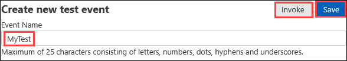

15. Log in to the CloudLabs portal and navigate to the required tenant (WIZ). On the left-hand side of the page, you will see the **Template** section.

16. Navigate to **Template (1)** from the left menu and go to your respective template. Click the **Edit (2)** button.

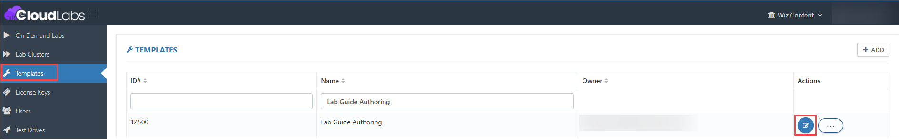

17. Scroll down to the **Course Details** section, then click on the **Manage** button.

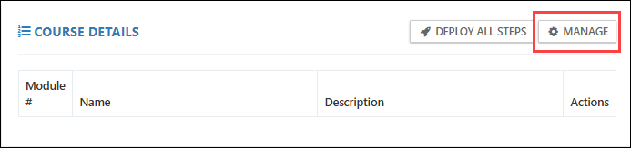

18. Click on the **+ Add** button.

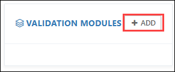

19. Provide the name **ValidationLambda** and click **Submit**.

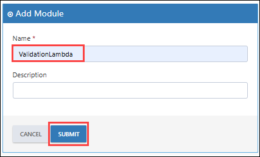

20. Click on the **+** symbol.

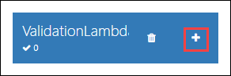

21. Click the **Labs +** symbol. Provide the type as **Lab**, name it **Validation Lambda**, and click **Submit**.

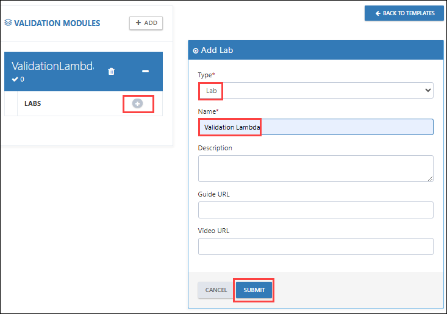

22. Click on the **+ Add** button again.


23. Select the **Validation Lambda** module and click the **+** icon. Configure the following highlighted fields:

* **Name:** validationlambda
* **Validation Type:** Custom
* **Platform Friendly Name:** Amazon Web Services
* **Script Type:** PowerShellV2
* **Script:**

  ```
  $url = "https://ltzwxvsm5tvyfc5uq6hh4ugs7u0faado.lambda-url.us-east-1.on.aws/"
  $response=Invoke-RestMethod -Uri $url -Method Get

  if ($response -like "*Success*")
  {
  $message = @{Status ="Succeeded"; Message = "Validation Success: $response"} | ConvertTo-Json
                  Push-OutputBinding -Name Response -Value ([HttpResponseContext]@{
                                  StatusCode = [System.Net.HttpStatusCode]::OK
                                  Body = $message})
  }
  else
  {
       $message = @{Status ="Failed"; Message ="Validation Failed"}| ConvertTo-Json
                  Push-OutputBinding -Name Response -Value ([HttpResponseContext]@{
                                  StatusCode = [System.Net.HttpStatusCode]::OK
                                  Body = $message})
       break 
  }
  ```
* **Run As:** System

24. After providing the above details, click **Submit** to save the configuration.

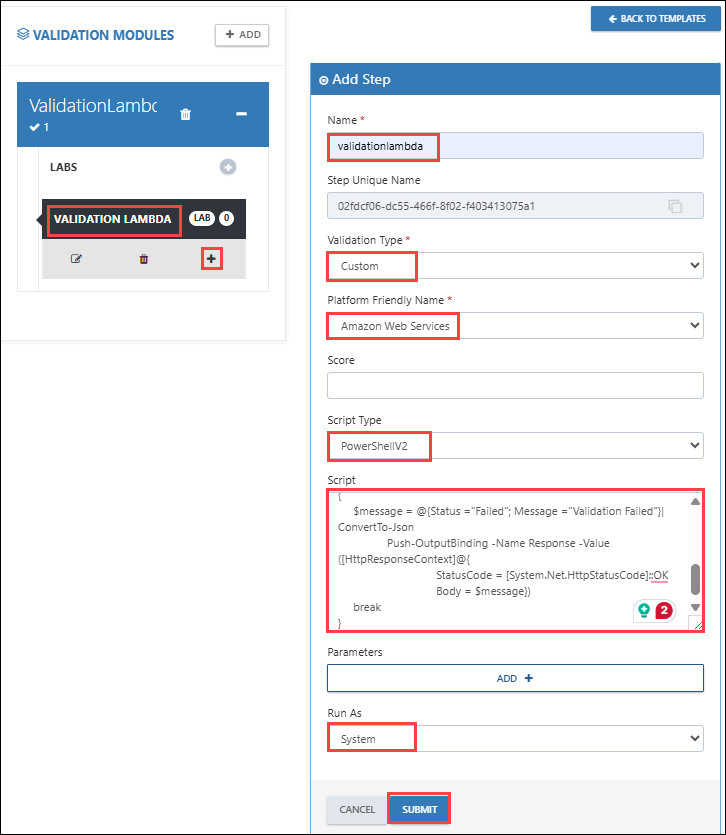

25. Click **Back to Templates**.

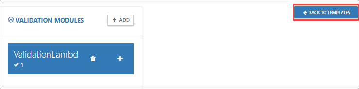

26. Click **Deploy All Scripts**.

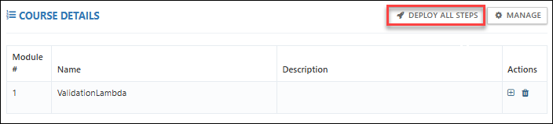

27. Click the **Submit** button.

28. Navigate to the **ODL (1)** section in the left menu, go to your respective ODL, click the **Users (2)** button, and deploy the user.

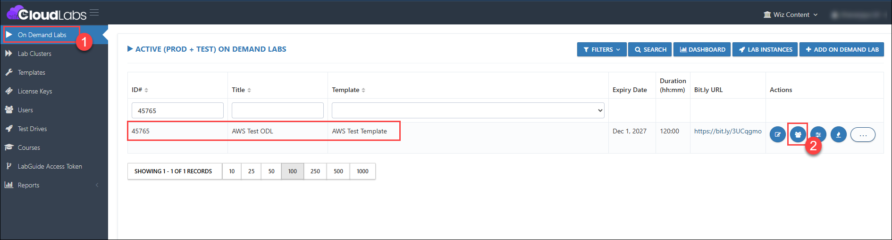

29. Once the user is deployed, click on the **Lab Validation** tab and then click the **Validate** button.

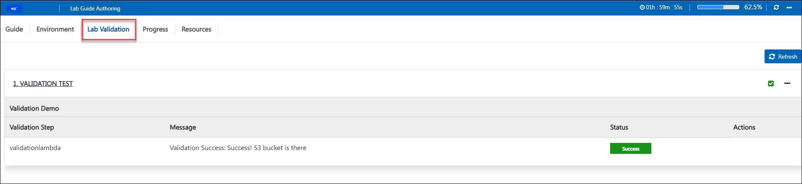

